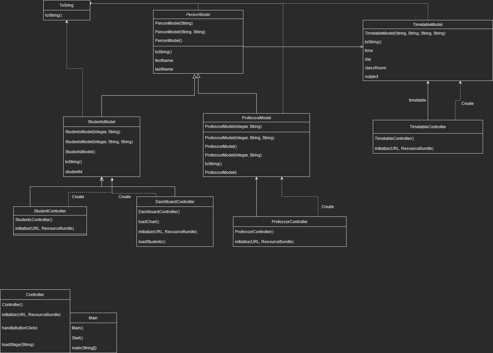
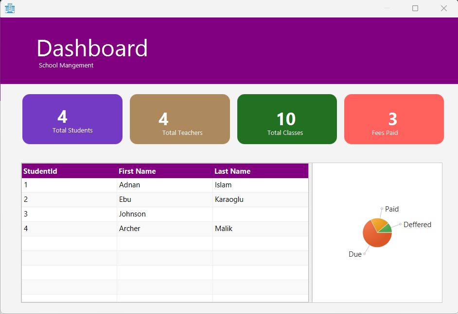

# Team3 CSC 211 Project
## Final Project Submission
The project was pushed into another branch and could be viewed in branchs.

master
### Theme
We created a School Management Application called SchoolManager. With the uses of java, Scene Builder,and Css.
It Displays data on the students, teachers, and there schedule.
### Feature List
- Home Screen
- A screen Showing Data and a pie Chart
- data of students
- data of Professors
- Class schedules

### Revised UML Diagram

### Screenshots and a short video

_________________________________________________________________________________________________________________________

## old Project Proposal
An aim Trainer is a tool many professional video game players use to improve their Aim(The mouse movements in an fps).
With this program, we as a group will be able to show our understanding of methods, classes, inheritance, overriding, etc.
